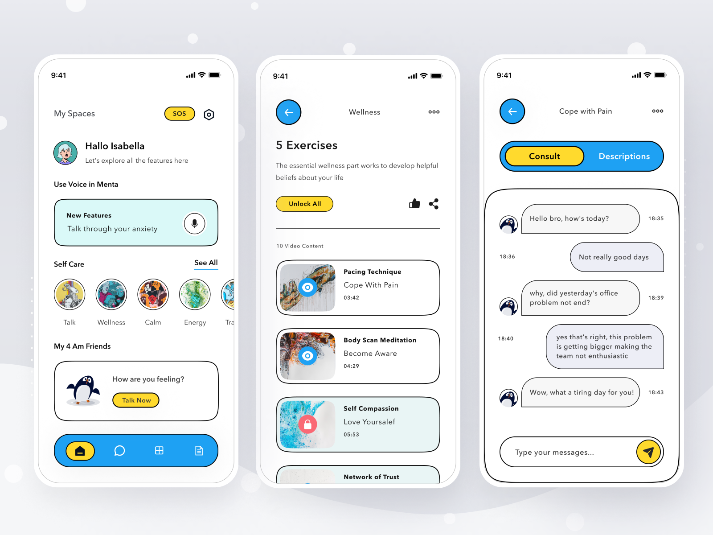

# Flutter Mental Health App

## Getting Started

This project is a starting point for a Flutter application.

A few resources to get you started if this is your first Flutter project:

- [Lab: Write your first Flutter app](https://flutter.dev/docs/get-started/codelab)
- [Cookbook: Useful Flutter samples](https://flutter.dev/docs/cookbook)

Only Thing Required for this to run is - 

- Android Studio Emulator for a android emulation.
- XCode and iPhone Framework in case of IOS.
- Install the pubsec.yaml file for all the requirements.
- And run the dart program in the main.
- Installation of Java is also important check the JAVA Version with you flutter.
- Install Java for Gradle if using VSCode but better use the code in with XML installed and in Android Studio.